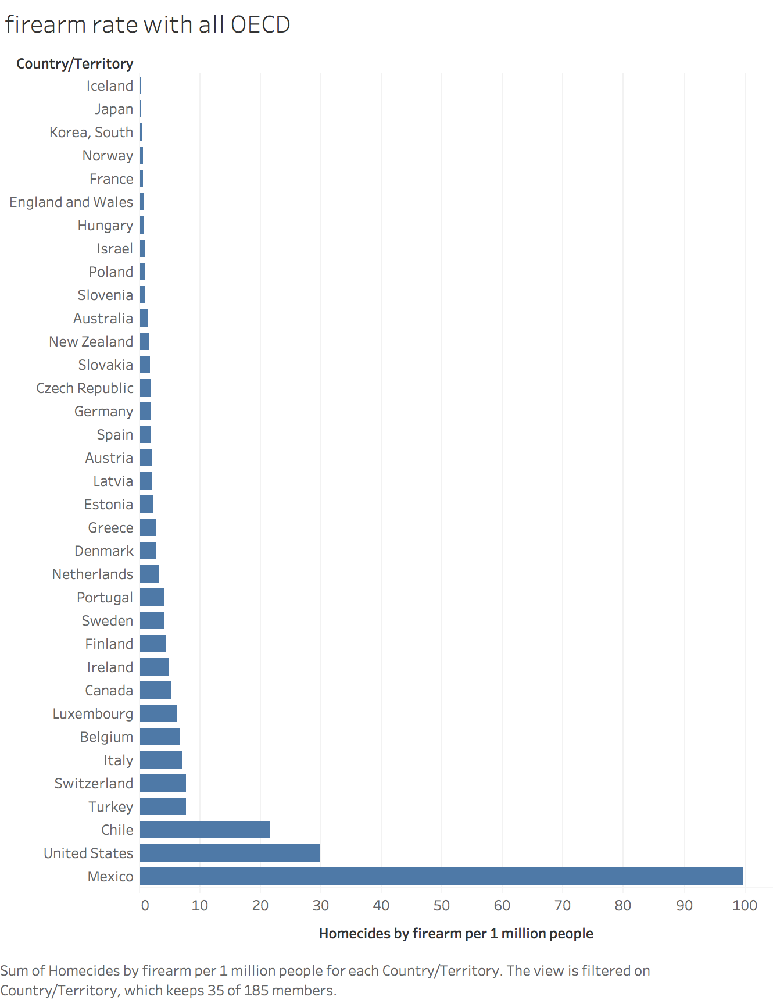

```{r setup, include=FALSE}
knitr::opts_chunk$set(echo = TRUE)
```

# Introduction
Data visualization aims to help people communicate information clearly and effectively through graphical means. In the last papers, I redesigned several interesting and counterintuitive data products and deceptive data products based on the article of Gun Violence in VOX, which could help me to support my contradictory arguments graphically. After learning several models in the class, I would like to revise/improve my data products in this paper, making the products more useful.

# Methodology
The following paper includes two general sections: 1) redesigned data products, and 2) revised deception products, which are consistent with the previous data products. In each section, three findings will be presented with graphs/tables. And each finding will have subsections of **description, analysis, and summary**. **description** talks about the designing process of data products, **analysis** focuses on explanation and comparison between the old and new products, and **summary** includes conclusion and limitation of data products. Finally, final thought or conclusion will be given at the end of paper. All data sources are same as the first version data products. All graphs are added titles, axis-labels to comprehend audience except the one on purpose under dual-axis graph.

# Redesigned Data Products 
## Finding 1: Definition really matters: key words should be well defined
## Finding 1.1: Which countries belong to developed countries? 
Vox Original Argument


Source: *the Guardian*

First Version


Source: *the Guardian* and *HDI official webiste*

[Public profile link](https://public.tableau.com/profile/feng.wang2440#!/vizhome/firearmrateper1MpeopleinDevelopedCountriesOriginal/original?publish=yes)



Source: *the Guardian* and *OECD official webiste*

[Public link](https://public.tableau.com/profile/feng.wang2440#!/vizhome/OECD_24/firearmratewithallOECD?publish=yes)

Final Version


Source: *the Guardian* and *HDI official webiste*

[Public profile link graph 1](https://public.tableau.com/profile/feng.wang2440#!/vizhome/firearmrateper1MpeopleinDevelopedCountries/firearmrateper1MHDIHighestCountry?publish=yes)


## Finding 1.2: Mass shooting: a media word with multiple definitions
First Version


Source: *Mass Shootings: Definitions and Trends*

Final Version


Source: *Gun Violence Archive* & *Mass Shootings: Definitions and Trends*

[Public link](https://public.tableau.com/profile/feng.wang2440#!/vizhome/mass_shooting_pie/mass_shooting_resource?publish=yes)

### Description
The Vox article has issues with clear definitions, which make audience confused and affect data selection. So I redesigned two data products with different definitions of "developed countries" and "mass shooting" in the first version. In the final version, I edit the data selection for each definitions: 1)"developed countries": I delete the OECD-defined developed countries and leave the HDI-defined developed countries, which makes the content more consistent with vox; 2) "mass shooting": instead of using tables show multiple resources in how mass shootings are defined and counted as the first version of data product, my final data product just selects one different source and make a pie chart to eye the difference.

### Analysis/Exploration
When I first read the article on Vox, I raised my doubt regarding the definitions of several terms, such as "developed countries" and "mass shooting". I think the clear definition is important in data visualization because difference in definitions will affect the data selection/fact, which result in different claims, according to the argumentation model.

To support claim in the Vox, the author selected 14 developed countries based on the *Human Development Index*(HDI). I researched the HDI website, and there's no hint why the author selected only 14 countries to compare, thus I reselected 51 countries that all belong to the category of very high human developed countries. I also selected all OECD countries, another indicator of developed countries, to make another graph showing how definition matters in the first version. In the final version, I delete the OECD graph, since using HDI indicator as developed countries would make the comparison between Vox and my argument more consistent, resulting in the claim to be more effective based on the principle of analytic design. In addition, I redesign the table to make a vertical bar graph, filter out the countries with zero firearm homicides (useless here), and highlight the US position. Doing so reduces the data pixel ratio and make audience catch most important argument.

There is no official definition of mass shooting, it is a pure media word. In my first version, I list and compare the different resources of mass shooting data. In my final version, I only select the resource of "Mass Shooting in America Database" to compare with the original database from Gun Violence Archive with a pie chart to let audience eye the difference. As I mention before, source from Stanford Geospatial Center would be the best match because it distinguishes from gangs, drugs, or organized crime mass shooting, which probably seek different solution of gun policy. In our words, the archive datasets are extravagated in mass shooting: among 371 mass shootings in 2015, only 67 were not related to gangs, drugs, or organized crime. Here, a pie chart works better than a table to show the significant difference between definitions. Furthermore, I manually check both datasets to ensure the *Gun Violence Archive* dataset actually includes all data in *Mass Shooting in America Database*,making sure I do not compare oranges with apples.

### Summary
The US is not an outlier for firearm homicides with clear defined developed countries, and there are less mass shootings occured if we disregard the mass shooting related to gang, drug, or organized crime, which is clearly not a concern in the Vox article.

To design a good data product, a good selection of data is critical to form a good argument. Also, following the design principles, such as maximum data-ink ratio, should make the data products more impressive and catch audience attention.


## Finding 2: Think hard about causel relationship: More gun deaths are suicides? Firearm suicide is just one method of suicide.

Vox


First Version


Final Version


[Public link](https://public.tableau.com/profile/feng.wang2440#!/vizhome/firearm_nonfirearm_suicide/Sheet1?publish=yes)

### Description
Vox article tried to claim that gun control would reduce suicide rate because firearm suicide is a large part of suicide compared with firearm homicide. However, comparisons between suicides with homicides were not on the same page, thus the claim is questionable. In my first version, I compared yearly total number of suicides with total number of firearm suicides, and found that the growth of firearm suicides was just a part of total growth trend of suicides. However, this graph still cannot see clearly if firearm suicide plays a major role in total suicides. So in my final version, I use total suicide minus firearm suicide to get the non-firearm suicide, and compare the yearly changes between firearm suicide and non-firearm suicide. We can see that both firearm suicide and non-firearm suicide are increasing, plus, except 2013 non-firearm suicides passed firearm suicides since 2006. Thus, the suicide death by method of firearms indeed declined over years.

### Analysis
Vox claims that gun control would reduce suicide rate, there should be an warranty that firearm suicide takes a large part of total suicide, which is not true. For the final version, we see that non-firearm suicide is on the trend to taking larger part of suicide, and it also tells us we should focus on suicide in general, instead of firearm suicide. Therefore, according to the augmentation model, my claim is that gun control cannot reduce suicide. The facts were both firearm suicides and non-firearm suicides increased over years, furthermore, non-firearm suicides increased quickly then firearm suicides by seeing the basepoint in 1999 and final point in 2016. And the warranty was that people can commit suicide in multiple ways, limiting firearm suicide cannot limit the suicide because of other methods.

### Summary
There are increasingly growth for both suicides and firearm suicide, but firearm suicide is just one method to commit suicide, and the percentage of firearm suicide was decreasing. 

The facts,claims, and warranty are all necessary to create a good argument, when analyzing the data products, be sure to figure out these important parts.

## Finding 3: Look carefully about cross section data: States with tighter gun control laws have fewer gun-related death? No, the rate of firearm death increases more in states with tighter gun control laws than that with no laws.

Vox


Source: *State Health Facts*

First Version Updated Maps


First Version Rate Change


Source: *State Health Facts*

[Public link](https://public.tableau.com/profile/feng.wang2440#!/vizhome/rateofchangefirst/lawpolicy?publish=yes)

Final Version


Source: *State Health Facts*

[Public link](https://public.tableau.com/profile/feng.wang2440#!/vizhome/rateofchangefirst/lawpolicy?publish=yes))


### Description
The Vox article used data from 2007, which was out of date due to lots of states published law policies since then, so I updated the data to 2014, and created new updated map in the first version. Additionally, I formed stacked bar charts to rebuttal that the states with tighter law policy actually had more growth rate in firearm death on average. In my final version, I delete the map graph, and decompose the law policy group into states, checking the firearm death rate change among states. In addition, I add an average line for each group, which is same as the stacked bar chart in the first version. 

### Analysis
Map chart is a popular choice when to display geographical data. Compared with bar or line charts, map is more fancy but easy to comprehend, catching the audience's attention. However, map becomes useless if it serves no function, according to the data pixel ratio model. A good use of map is to show points or specific locations, but if there are comparisons between data, map is not a good option. Simple bar works better. Therefore, I delete map in the final version.

In this finding, the goal is to have fewer gun-related deaths, and the question is that could the states with gun-related law policies would have fewer gun-related deaths? So the metric includes firearm death rate per state, state with/without law policies, etc. Since the goal is to have "fewer" gun-related death, and "fewer" is a indicator for comparison. So I transform static firearm death rate to firearm death rate change between years 2015 and 2014, and years 2016 and 2015, after the law policy became enforced in 2014. The first version is the aggregate result of average rate of change in firearm death, and the final version looks each state in detail. I prefer the final one since it not only includes the general comparison between group with law policy and without, also consists of each state's rate of change in firearm death, which is easy to detect an outlier. It is easy to draw conclusion that states with gun-control laws have higher rate of change in number of firearm death compared with states without laws.

### Summary
The final version of data tells us the states with gun-control laws have higher rate of change in firearm death, therefore, gun-control policies does not reduce gun-related death effectively.

Look carefully about cross section data, and map, though fancy and drawing attention, does not always work for all type of data, especially for comparison data. Transforming metrics in the dataset can serve your question and goal effectively.


# Revised Deception Products

## Finding 4: Not all days are equal, mass shooting actually happend mostly on weekend in 2015

Vox


source: *Gun Violence Archive*

First Version


source: *Gun Violence Archive*

[Public profile link](http://public.tableau.com/profile/feng.wang2440#!/vizhome/mass_shootingweekday/Sheet1)

Final Version


source: *Gun Violence Archive*

[Public link](https://public.tableau.com/profile/feng.wang2440#!/vizhome/mass_shootingweekday_final/revised?publish=yes)

### Description
The calendar view chart is a fancy but ineffective chart to show the frequency of mass shooting. According to the data pixel ratio model, an aesthetic visualization should state the function first, then the form of chart. So I redesigned the products in the view of days of week, instead of calendar view in the first version. Doing so, the new graph supports my argument that most mass shootings happened on weekends. In the final version, I only edit the title as well as the color of the graph to create more contrast and impressive chart.

### Analysis
In my opinion, the calendar chart used lots of pixel to cover unnecessary contents, and did not serve good purpose in claiming the mass shooting occurred every day. Audience can see clearly there are zeros in the calendar day. Instead, a basic math formula:  $$total mass shooting records in 2015→ 355 / total day of year → 365$$ would support the claim perfectly than a calendar view. So I changed the data products to find new pattern of mass shooting in the view of days of week. The first version is a relative good data products to support the claim that most mass shootings happened during weekend in 2015. And it also make sense that most people are free during weekend and hanged out in public area.

To have better visual encoding, I use different color to distinguish categories: weekday vs weekend in the final version. Namely, I choose orange versus gery because these two colors give audience high contrast vision between different categories, and I do not choose blue, red, or green as colors to avoid audience with red-green colorblindness. Therefore, compared with the first version, the final version of data product emphasizes more on the situation of weekend, drawing audience's attention towards the most important data. Additionally, adding a title gives audience more effective information about the graph.

### Summary
Not all days are equal, mass shooting actually happen most during weekend in 2015. Using colors effectively can draw audience's awareness on the argument in the graph.


## Finding 5: More guns, less number of gun deaths per state

Vox


Source: Kalesan et al., *Gun Ownership and Social Gun Culture*

First Version


Source: Kalesan et al., *Gun Ownership and Social Gun Culture*

[Public profile link](https://public.tableau.com/profile/feng.wang2440#!/vizhome/state_gun_ownership_with_death_rate/Sheet2)

Final Version


Source: Kalesan et al., *Gun Ownership and Social Gun Culture*

[Public link](https://public.tableau.com/profile/feng.wang2440#!/vizhome/gun_ownership_final/gunownershipgundeath?publish=yes)

### Description
When looking at scatter plot, a trend line is an important sign to audience about the relationship/association between X variable and Y variable. In my first version, I rescale the Y axis trying to weak the scope of line to indicate little or almost no impact of gun ownership on gun deaths per state. In my final version, I use the same dataset but different Y variable (total number of people death per state) to create new graph. As can be see from the graph, the line is decreasing, which means the more gun ownership has a decreasing trend for the number of death per state. In addition, I add a reference vertical line showing national average gun ownership rate.

### Analysis
The first version does poor job to design data model because the graph is unbalanced: the empty space is useless, and the shape of data does not make any sense. Furthermore, though little, positive trend still can be viewed by audience. Therefore, it isn't a good deceptive data product. I reanalyze the datasets, and find that the Y variable "gun-death per 100,000 residents" is adjusted for differences in age-distributions and population size, in addition, the datasets does not take into account other state specific population characteristics which may influence the level of mortality. In my opinion, it's fine to use the "number of death" (another variable in the dataset) to measure gun death: leaving the number unadjusted with age and population makes sense because people care more about the exact number of death ignoring the age and population size. The gun-death rate is more relevant in time series data, not static data here. Therefore, I changed the Y variable to "number of death" to check the scatter plot. Additionally, I change the shape of data to make graph more clearly. Surprisingly, the trend changes, and concludes that more guns associates with less number of gun deaths per state.

### Summary
More guns, less number of gun deaths per state. When design the graph, we should maximize the data-ink ratio, leaving the non-erable core of a graphic, deleting the redundant ink. Also, the data must be relevant.


## Finding 6: The rate of firearm homicides increases more than the rate of firearm suicides between 2014 and 2016.

Vox


Source: *Centers for Disease Control and Prevention (CDC)*

First Version


Source: *Centers for Disease Control and Prevention (CDC)*

[Public profile link graph 1](https://public.tableau.com/profile/feng.wang2440#!/vizhome/suicides_vs_homicides_with_axis/Sheet3)

Final Versions


Source: *Centers for Disease Control and Prevention (CDC)*

[Public profile link graph 2](https://public.tableau.com/profile/feng.wang2440#!/vizhome/suicides_vs_homicides_withoutlables/Sheet3)


Source: *Centers for Disease Control and Prevention (CDC)*

### Description
To design a deceptive data product, I filtered the original dataset and selected only the recent years from 2014 to 2016, to compare the firearm suicide versus firearm homicide in the first version.  In the final version, I edit the graph, hiding the Y axises lables but adding the numbers on the line. Hiding the Y axis will make readers more focus on the lines and respect ratio, and less confusing with the dual Y labels, giving audiences' wants according to audience model. In addition, I develop a new 100% stacked bar chart to further show the change of composition between firearm suicides and firearm homicides. This bar chart consists with the dual axis line chart, which ensure audience the claim. 

### Analysis
I use the dual axis technique to combine the lines together to emphasize perception of growth rate in audience's eyes. It does a wonderful job to change the perception of the audience compared with the original graph. Therefore, I leave the dual axis graph for final version and just revise a little. Deleting Y labels makes the graph more contrast visually. With less details, the graph gives audience a good overview regarding the yearly trend between firearm suicide and firearm homicide. Additionally, I use the new 100% stacked bar chart to further prove the dual-axis chart that the percentage of firearm homicides increase over year as a backing. I would like to combine these two graphs, unfortunately I do not find ways. 

### Summary
The rate of firearm homicides increases more than the rate of firearm suicides between 2014 and 2016. A good graph will give audience with clear overview, less redundant details. Furthermore, it's better to include a backing when using analytics model because it helps convince the audience and further support the warrant if it is not initially accepted.

# Conclusion
Data visualization is really helpful to assist people state their opinions visually. But telling a good story with data visualization is not easy. Same dataset can generate variety of stories. To make the data products efficiently and effectively, fundamental of design principles must be carefully followed, and data designer must understand the wants, needs, and fear of their audiences. Sometimes, simple data graph is worthy more than a fancy chart.

After revising all the data products, my final points regarding to gun violence are: 

1.The US is not an outlier for firearm homicides among developed countries.

2. Mass shooting increased over years, yet most of mass shooting is related to gang, drug, and organized crime. There is no need to worry about mass shooting like Media in general public. One lesson: mass shooting most happened during weekend, so be alert going out during weekend.

3. Per state, more guns, less absolute number of gun deaths. The gun-control policies does not reduce gun-related death effectively.

4. Firearm suicides account for large portion in firearm death(suicide plus homicide). However, firearm suicide is just one method of suicide, and the portion of firearm suicide actually decreases over years. Gun and suicide has no clear positive relationship.

# Reference

Gun Violence Archive (2015). Accessed from http://www.gunviolencearchive.org/.

Human Development Reports. Accessed from http://hdr.undp.org/en/composite/HDI

Kalesan B, Villarreal MD, Keyes KM, et al. Inj Prev 2016;22: 216–220.

Krouse, William J., and Daniel J. Richardson, Mass Murder with Firearms: Incidents and Victims, 1999–2013, Washington, D.C.: Congressional Research Service, R44126, 2015.

Lopez, German (2018). America's Unique Gun Violence Problem, Explanied in 17 Maps and Charts. Vox. Accessed from https://www.vox.com/policy-and-politics/2017/10/2/16399418/us-gun-violence-statistics-maps-charts.

Mass Shooting Tracker, homepage, undated. As of October 20,2016: https://www.massshootingtracker.org

Smart Gosanna. Mass Shootings: Definitions and Trends. RAND Research. Accessed from https://www.rand.org/research/gun-policy/analysis/supplementary/mass-shootings.html

State Health Facts (2016). Kaiser Family Foundation. Accessed from https://www.kff.org/other/state-indicator/firearms-death-rate-per-100000/?currentTimeframe=0&sortModel=%7B%22colId%22:%22Location%22,%22sort%22:%22asc%22%7D


