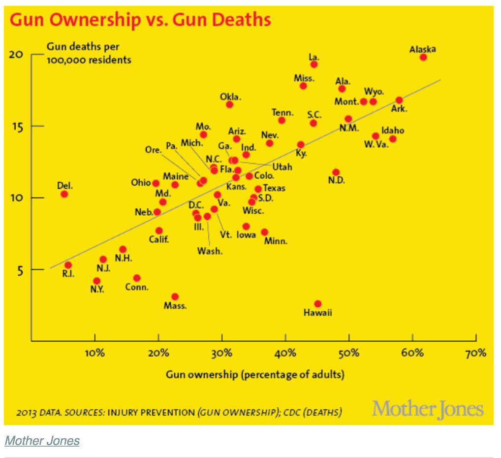

# Redesign Deceptive Data Products for Gun Violence in the US

# Introduction

Data deception, defined by School of Law at the New York University, as “a graphical depiction of information, designed with or without an intent to deceive, that may create a belief about the message and/or its components, which varies from the actual message"(Pandey et al., 2015). In this paper, I will redesign three deceptive data products with the purpose to make a contradictive arguments from the article on VOX (Lopez 2018). The data sources come from the original data sources from the article.

# Methodology

First, I will discuss the common distortion techniques that cause to a deceptive data visualization. Then I will redesign three deceptive data products by using the missteps that show contradictive results. In each data products, I will present both orginal and redesigned products to do compare and contrast analysis.

# Common Deception Techniques

1. Truncated Y Axis

Truncated Y axis is a common technique to distort data visualization. Y axis is changed by adjusting the minimum and maximum values. Such change will deliver either an exaggerated or understandment message that affects data readers' "response to the 'how much' type of questions" (Pandey et al., 2015).

2. Improper Scaling and Use of Illustrations

Improper scaling is another common deception technique. When visualizing the data, people usually are very sensitive to the volumn, size, and shape of data (Krystian, 2016). So by improper scaling will affect readers' visions of data and cause the readers receive wrong message. Also by using illustration instead of proper columns contributes to distraction and not easy to read (2016).

3. Aspect Ratio

Aspect ratio most affects line charts "as it directly impacts the rate of increase or decrease of one quatity over another" (Pandey et al., 2015).

4. Misusing the Dual-Axis

Dual axis is used to "compare two varaibles with different magnitudes and scales of measurements" (Krystian, 2016). The question is that dual axis  does change the perception of the reader, causing them to receive wrong message. 

# Findings

## Finding 1 

### Originial Argument: 4) On average, there is around one mass shooting for each day in America.

source: *Gun Violence Archive*

### New Argument: Not all days are equal, mass shooting actually happended most on weekend in 2015.
[Public profile link](http://public.tableau.com/profile/feng.wang2440#!/vizhome/mass_shootingweekday/Sheet1)

In the original argument, the arthor used calender view to demonstrate the records of mass shooting in 2015, indicating that there was really lots of mass shooting, on average per incident per day. Doing so, the arthor emphasized the frequency of mass shooting, and gave a sense of nervours to reader since it seems that mass shooting occured every day.

In the new argument, I first group the incidents by day of week, then truncate Y axis by chaning minimum value to 20. So in the new graph, readers will easily see that most mass shootings happended on weekend(Sunday and Saturday), not all days were equal. By changing data patterns as well as altering Y axis, I have purpose to release reader's sense of nervours, switching focus more on weekend, instand of everyday.

## Finding 2

### Originial Argument: 5）States with more guns have more gun deaths

Source: Kalesan et al., *Gun Ownership and Social Gun Culture*

### New Argument: There is little impact of gun ownership on gun deaths per state.
[Public profile link](https://public.tableau.com/profile/feng.wang2440#!/vizhome/state_gun_ownership_with_death_rate/Sheet2)

In the original argument, the arthor used line chart to show that the more gun ownership the state has, the more gun death per 100,000 residents. In that case, gun ownership did play imporant role in gun death in states.

In the new argument, I rescale the Y axis changing the maximum value from 20 to 200 (10X scale), which changes result visually: by seeing the almost flat trend line of new graph, it easily to state that there is little impact of gun onership on gun deaths per state.

## Finding 3

### Originial Argument: 10) Most gun deaths are suicides.

source: *Centers for Disease Control and Prevention*

### New Argument: The rate of firearm homicides increases more than the rate of firearm suicides between 2014 and 2016.

[Public profile link graph 1](https://public.tableau.com/profile/feng.wang2440#!/vizhome/suicides_vs_homicides_with_axis/Sheet3)

In the original argument, the arthor used line chart to compare the number of firearm suicides versus homicides from year of 1999 to 2016, indicating that the number of firearm suicides was always greater than that of homicides. The author would like to state that firearm suicide was indeed the problem rather than the firearm homicides.

In the new argument, I only select data from 2014 to 2016 to form line chart with dual axis to compare gun-death suicides versus homicides. For one thing, readers will see the rate of firearm homicides(aspect ratio) is greater than that of firearm suicides, which means that the growth rate of gun-death homicides is bigger than gun-death suicides.Even though the number of firearm suicides is large, yet the firearm homecides grows more, therefore, firearm homicide is the problem. This contradicts authoer's argumenent. For another thing, I use dual axis to emphasize  perception of grwoth rate in readers' eyes. It is easily to see that magnitudes are different between firearm homicides(right Y) and firearm suicides(left Y). Evenmore, by hiding Y axis will give reader strong percetption that the firearm homicides grow more than firearm suicides.

# Conclusion

As we can see from above findings, data deception does change the orginal messages. Common deception technique includes truncating  Y Axis, improper scaling and illustration, aspect ratios, and misusing of dual axis. We must be careful to handle data deception in visualization process.

# Reference

Gun Violence Archive (2015). Accessed from http://www.gunviolencearchive.org/.

Kalesan B, Villarreal MD, Keyes KM, et al. Inj Prev 2016;22: 216–220.

Krystian, Marisa (2016). Watch Out! 4 Common Missteps that Lead to Deceptive Data Visualizations. Infogram. Accessed from https://infogram.com/blog/4-common-missteps-that-lead-to-deceptive-data-visualizations/.

Lopez, German (2018). America's Unique Gun Violence Problem, Explanied in 17 Maps and Charts. Vox. Accessed from https://www.vox.com/policy-and-politics/2017/10/2/16399418/us-gun-violence-statistics-maps-charts.

Pandey, A. V., Rall, K., Satterthwaite, M. L., Nov, O., & Bertini, E. (2015). How deceptive are deceptive visualizations? An empirical analysis of common distortion techniques. In CHI 2015 - Proceedings of the 33rd Annual CHI Conference on Human Factors in Computing Systems: Crossings (Vol. 2015-April, pp. 1469-1478). Association for Computing Machinery. DOI: 10.1145/2702123.2702608

